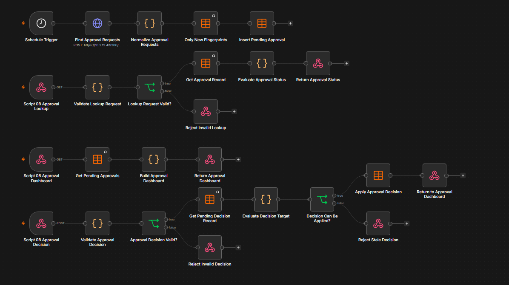

# Compton College Lab Maintenance Scripts

[](https://learn.microsoft.com/powershell/)
[](https://www.microsoft.com/windows/windows-11)
[](#scheduled-task-deployment)

PowerShell-based maintenance automation for Compton College Windows lab computers. The project synchronizes a controlled maintenance package to each endpoint, runs recurring work under `NT AUTHORITY\SYSTEM`, verifies changes, publishes human-readable logs and Elastic-compatible telemetry, and supports computer-name-based configuration targeting.

The active endpoint scripts are designed primarily for 64-bit Windows PowerShell 5.1.

> [!IMPORTANT]
> Review server paths, credentials, enrollment tokens, computer-name patterns, maintenance windows, firmware settings, and scheduled times before using this project outside the protected Compton College deployment environment.

## Contents

- [Project goals](#project-goals)
- [Repository inventory](#repository-inventory)
- [Detailed script descriptions](#detailed-script-descriptions)
- [Script 08 n8n repair approvals](#n8n-repair-approval-process)
- [Supporting files](#supporting-files)
- [Scheduled task deployment](#scheduled-task-deployment)
- [Deployment workflow](#deployment-workflow)
- [Logging and telemetry](#logging-and-telemetry)
- [Security considerations](#security-considerations)
- [Retired scripts](#retired-scripts)

## Project goals

- Automate recurring maintenance on shared Windows lab computers.
- Keep `C:\Scripts` synchronized with the approved central package.
- Run maintenance as SYSTEM without requiring an interactive administrator session.
- Verify changes instead of treating a successful command launch as proof of success.
- Preserve readable logs, latest-state JSON, and NDJSON events for Elastic.
- Build current hardware, BIOS, warranty, health, and normalized software inventory.
- Limit automated remediation to explicitly approved actions and maintenance windows.
- Protect boot-critical, storage, firmware, and encrypted-system operations with safety gates.
- Retain rollback copies when managed scripts are replaced or retired.

## Repository inventory

### Active endpoint and deployment scripts

| File | Current responsibility |
|---|---|
| [`Post-Deployment.ps1`](./Post-Deployment.ps1) | Prepares newly deployed HP or Dell computers, services vendor drivers/firmware, installs PaperCut and Action1, removes Copilot through the shared module, refreshes `C:\Scripts`, registers tasks, activates Office LTSC 2024 when present, updates applications and Windows, and optionally reboots. |
| [`00_Update-Scripts-FromShare.ps1`](./00_Update-Scripts-FromShare.ps1) | Manifest-driven, self-updating synchronization of approved files from the configured primary or fallback deployment share; validates syntax and hashes, creates rollback copies, retires superseded files, and reconciles scheduled tasks. |
| [`01_Enable_Windows_Update_Services.ps1`](./01_Enable_Windows_Update_Services.ps1) | Bootstraps the current package, restores Windows Update services/tasks/policies, verifies service recovery, applies standard Windows UI configuration, and can reboot when critical update services cannot be recovered. |
| [`02_Remove_User_Profiles.ps1`](./02_Remove_User_Profiles.ps1) | Removes eligible stale user profiles with protected-profile, loaded-profile, age, timeout, and disk-space safeguards; applies the standard Windows 11 user environment. Copilot and Edge ownership have moved to Script 04. |
| [`03_Weekend_Apps_Update.ps1`](./03_Weekend_Apps_Update.ps1) | Inventories available application upgrades, updates supported packages through WinGet, handles pinned/unknown packages according to switches, services Office Click-to-Run, and publishes per-application results. |
| [`04_Sunday_Lab_Application_Maintenance.ps1`](./04_Sunday_Lab_Application_Maintenance.ps1) | Consolidated Sunday application/configuration runner: restore point, printing, Office migration/activation, Edge InPrivate, Elastic Agent, browser defaults/homepages, Adobe lab policy, Stellarium location, startup allowlist, and final Copilot cleanup. Honorlock remains embedded but disabled because GPO owns it. |
| [`05_Weekend_HP_Drivers_Update.ps1`](./05_Weekend_HP_Drivers_Update.ps1) | Vendor-aware HP/Dell maintenance with safe driver filtering, HPIA/DCU workflows, HP BIOS Internet-update policy, AV scheduled power-on, Dell Wake-on-LAN validation, Dell cleanup of orphaned HP software, and hardware/driver telemetry. |
| [`06_Weekend_Windows_Updates.ps1`](./06_Weekend_Windows_Updates.ps1) | Installs Microsoft/Windows updates with PSWindowsUpdate, optionally resets Windows Update components, compares pre/post compliance, records detailed results, and reports—but does not itself perform—the required reboot. |
| [`07_Force_Reboot_Install_Updates.ps1`](./07_Force_Reboot_Install_Updates.ps1) | Coordinates a persistent, verified multi-reboot cycle; supports scheduled, startup-resume, maintenance-closeout, and final-verification modes; records the source of persistent reboot flags. |
| [`08_System_Repair.ps1`](./08_System_Repair.ps1) | Performs DISM/SFC, storage, WMI, RPC, Explorer, Windows Update, management-agent, disk-usage, and cleanup diagnostics/repairs. Persistent corruption requires explicit opt-in plus a matching, unexpired n8n approval before source-WIM/in-place repair escalation. |
| [`09_Disable_Windows_Update_Services.ps1`](./09_Disable_Windows_Update_Services.ps1) | Applies and verifies the post-maintenance Windows Update service, scheduled-task, and registry-policy state. |
| [`10_Sync_System_Time.ps1`](./10_Sync_System_Time.ps1) | Detects domain or standalone time mode, configures Windows Time, safely restarts/resynchronizes it, validates offset/source/stratum, and publishes recent time-service evidence. |
| [`14_Endpoint_Health_Inventory.ps1`](./14_Endpoint_Health_Inventory.ps1) | Produces the authoritative endpoint snapshot: hardware, OS, BIOS settings/version, warranty, security, networking, drivers, health findings, remediation candidates, normalized software records, and uninstall tombstones. |
| [`16_Check_Deep_Freeze_Status.ps1`](./16_Check_Deep_Freeze_Status.ps1) | Uses the Faronics CLI to report Frozen, Thawed, Unknown, or NotInstalled state and tracks how long the current state has persisted. |
| [`Repair-MicrosoftEdgeUpdate.ps1`](./Repair-MicrosoftEdgeUpdate.ps1) | Detection-first Edge Update repair for the fixed `MicrosoftEdgeUpdateRepair` remediation class; verifies policy, services, tasks, updater state, and optional signed Enterprise MSI repair. |
| [`Repair-Windows-ComponentStore.ps1`](./Repair-Windows-ComponentStore.ps1) | Script 08 escalation helper: identifies the matching `install.wim` index, stages a compatible ADK DISM when needed, tries WIM and Windows Update repair sources, verifies DISM/SFC, and can launch a guarded in-place repair while the computer is thawed. |

### Administrative, framework, and validation files

| File | Purpose |
|---|---|
| [`Register-Tasks_SYSTEM.ps1`](./Register-Tasks_SYSTEM.ps1) | Idempotently creates and repairs the approved SYSTEM scheduled tasks, removes obsolete task names and retired-script references, and publishes reconciliation telemetry. |
| [`Invoke-MaintenanceScript.ps1`](./Invoke-MaintenanceScript.ps1) | Allowlisted launcher that maps a fixed `ActionId` to an approved script and fixed arguments; enforces policy, dependencies, execution locking, remediation metadata, and maintenance windows. |
| [`Get-MaintenanceFleetStatus.ps1`](./Get-MaintenanceFleetStatus.ps1) | Reads endpoint status documents from configured fleet-status shares and produces an operator-friendly fleet summary. |
| [`Update-DeploymentManifest.ps1`](./Update-DeploymentManifest.ps1) | Rebuilds `DeploymentManifest.json`, extracts versions, calculates hashes, preserves required ordering/metadata, and writes the manifest safely. |
| [`Test-AllMaintenanceScripts.ps1`](./Test-AllMaintenanceScripts.ps1) | Parses every `.ps1` and `.psm1` in a selected source directory and exits nonzero if any PowerShell parser error is found. |
| [`Test-MaintenanceTelemetry.ps1`](./Test-MaintenanceTelemetry.ps1) | Concurrently stress-tests NDJSON telemetry writes and rotation, then reports invalid JSON lines and created archives. Use only as a controlled validation test. |
| [`Maintenance.Framework.psm1`](./Maintenance.Framework.psm1) | Shared initialization, logging, telemetry, event-log, retention, policy, maintenance-window, dependency, lock, and fleet-status functions. |
| [`Maintenance.Copilot.psm1`](./Maintenance.Copilot.psm1) | Canonical Copilot removal and prevention implementation used by Script 04, Script 08 when explicitly enabled, and post-deployment. |
| [`Maintenance.Policy.json`](./Maintenance.Policy.json) | Central policy for windows, dependencies, locks, retention, fleet-status paths, and launcher behavior. |
| [`SoftwareInventory.Policy.json`](./SoftwareInventory.Policy.json) | Defines which non-system applications Script 14 tracks, exclusions for Windows/runtime components, canonical product names/categories, and snapshot retention. |
| [`DeploymentManifest.json`](./DeploymentManifest.json) | Version and SHA-256 inventory of managed deployment files. |
| [`BUILD-VALIDATION.json`](./BUILD-VALIDATION.json) | Records package-level structural validation and whether Windows PowerShell parser validation is still required. |
| [`SHA256SUMS.txt`](./SHA256SUMS.txt) | Human-readable checksum list for repository artifacts. |
| [`README-Maintenance-Framework.txt`](./README-Maintenance-Framework.txt) | Focused operational notes for the shared maintenance framework. |

## Detailed script descriptions

### `Post-Deployment.ps1`

Runs a section-isolated initial deployment workflow. It detects HP or Dell hardware; performs supported vendor driver, BIOS, and firmware work; temporarily adjusts power behavior; suspends BitLocker when required for vendor firmware; installs PaperCut Print Deploy and Action1; removes Copilot; refreshes the local maintenance folder; executes task registration; checks and activates installed Office LTSC 2024; updates WinGet applications and Windows; and optionally reboots. A failure in one section is logged without preventing later sections from running.

The public copy intentionally uses placeholder deployment paths. Do not commit production enrollment data, credentials, or private share information.

### `00_Update-Scripts-FromShare.ps1`

The updater persists the last working source roots so a self-update does not revert to public placeholders. It validates `DeploymentManifest.json`, restricts deployment to an internal approved-file list, directly deploys critical supplemental files during manifest transitions, compares SHA-256 hashes, parses PowerShell before and after installation, rejects updater downgrades, updates itself last, and relaunches with the working source configuration. Superseded numbered scripts are retired only after Script 04 validates successfully.

### `01_Enable_Windows_Update_Services.ps1`

Prepares the endpoint for the maintenance window by synchronizing Script 00 first, restoring required Windows Update services and registry startup modes, enabling required update tasks, removing conflicting policy values, and retrying service startup. It records before/after service and policy state, reconciles the master schedule, and can force a controlled reboot if critical services remain unavailable.

### `02_Remove_User_Profiles.ps1`

Enumerates local profiles without using destructive broad deletion. It excludes configured accounts, system/special profiles, and loaded hives; can enforce an age threshold; measures profile sizes; removes OneDrive tasks associated with deleted profiles; maintains resumable cleanup state; limits concurrent deletion jobs; and records deleted, skipped, deferred, timed-out, and failed profiles plus recovered disk space.

It also applies the standard Windows 11 UI preferences to current, loaded, offline, and Default User hives. As of version 2.5.0, it no longer removes Copilot or configures Edge InPrivate; those recurring functions belong to Script 04.

### `03_Weekend_Apps_Update.ps1`

Refreshes WinGet sources, captures available-upgrade inventory, runs the general upgrade operation, and performs targeted retries where appropriate. It can include unknown versions, optionally include pinned packages or Microsoft Store sources, intentionally defers self-servicing packages such as App Installer, services Office Click-to-Run, detects pending reboot state, and writes normalized per-application before/after/failure telemetry plus a latest application-inventory file.

### `04_Sunday_Lab_Application_Maintenance.ps1`

Runs each major section independently so a child script's functions, strict mode, or `exit` cannot terminate the remaining workflow. Current sections are:

1. Enables System Restore, initializes shadow-copy services, creates and verifies a restore point, and removes obsolete managed restore points.
2. Maintains the SHARP driver, PaperCut Print Deploy, and `StudentSecurePrint` connection.
3. Detects Office products, migrates supported older perpetual/LTSC suites, and—only when Deep Freeze is installed—replaces Microsoft 365 Apps with Office LTSC 2024; verifies machine-wide activation.
4. Starts Edge InPrivate on targeted `SSB-122-*`, `SSB-114*`, and `SSB-171*` computers while explicitly leaving autologon disabled and existing Winlogon settings unchanged.
5. Installs, enrolls, repairs, or verifies Elastic Agent for configured computer-name prefixes.
6. Sets `https://www.compton.edu` as the Chrome, Edge, and Firefox homepage/startup page; suppresses Chrome sign-in/onboarding/default-browser prompts; applies a supported default-associations XML that makes Chrome the handler for HTTP, HTTPS, `.htm`, and `.html`.
7. Applies Adobe Reader/Acrobat machine policy that suppresses Pro trials, upsells, account sign-in, Document Cloud, cloud connectors, and first-run online experiences while preserving local PDF functions.
8. Retains the embedded Honorlock installer for rollback/reference, but leaves it disabled because Group Policy owns deployment.
9. Enables Windows Location Services for Stellarium on configured labs.
10. Enforces the startup-app allowlist for existing users and Default User, and suppresses HP notification consumer popups without removing HP hardware-support components.
11. Runs final Copilot cleanup after application maintenance so Copilot restored by Edge or other servicing is removed before inventory.

The current startup allowlist contains `DWRCST.EXE`, `initialise.bat`, `OneDrive.exe`, `student.exe`, `teacher.exe`, and `RtkAudUService64.exe`. Non-allowlisted startup entries are disabled, not uninstalled.

### `05_Weekend_HP_Drivers_Update.ps1`

Detects the hardware vendor and chooses the matching workflow. HP uses HPIA and HP CMSL; Dell uses Dell Command Update and verifies its supporting service and .NET Desktop Runtime. Normal scheduled operation permits safe unattended driver/application classes while BIOS, firmware, storage, chipset, controller, Intel RST, VMD, NVMe, and other boot-sensitive categories require explicit switches.

Additional platform controls include:

- Idempotently disabling HP BIOS Internet/network firmware updates through the supplied BCU/password resources.
- Setting the AV-computer scheduled power-on policy, including HP models that expose separate integer hour/minute settings.
- Verifying Dell BIOS wired Wake-on-LAN and physical Ethernet-adapter wake settings.
- Removing orphaned HP management/support software, services, tasks, and inactive component-driver packages from Dell images while preserving printer, scanner, and active peripheral support.
- Recording hardware, storage, Device Manager, installed-driver, driver-change, vendor-utility, update-selection, and failure telemetry.

### `06_Weekend_Windows_Updates.ps1`

Ensures NuGet/PSWindowsUpdate prerequisites, optionally resets Windows Update components, captures Windows build/update/reboot state, installs available Microsoft updates with an operation timeout, and compares available updates before and after the run. The same script is scheduled twice; Script 07 owns reboot coordination.

### `07_Force_Reboot_Install_Updates.ps1`

Uses a durable state file and single-instance lock to prevent repeated or unverified reboot consumption. It requires a newer boot time before advancing a reboot stage, can recover an abandoned non-startup cycle, inventories pending-reboot flags and likely causes, optionally clears only approved flags, and stops after the configured maximum. Startup resume exits safely when no active cycle exists; closeout/final-verification modes do not reboot a clean computer.

### `08_System_Repair.ps1`

Runs detection-first repairs with disruptive operations controlled by switches. Major areas include DISM component-store detection/repair, SFC and CBS corruption extraction, volume scan/SpotFix/offline repair, SSD/NVMe SMART and reliability data, WMI, DNS/network reset options, RPC root-cause testing, Explorer crash/hang and shell-extension diagnostics, Search/Explorer cache repair, Action1 validation, SoftwareDistribution cleanup, and optional HP driver-only repair when CBS evidence supports it.

Component-store escalation is disabled by default. With `-AutoRepairOnDetection`, Script 08 first completes its ordinary online DISM/SFC workflow and repeats DISM/SFC verification. If corruption remains, escalation requires **both** `-AllowComponentStoreEscalation` and a matching, unexpired n8n approval. Missing approval, rejection, expiration, an unreadable key file, or a failed API lookup defers escalation. Once authorized, Script 08 invokes `Repair-Windows-ComponentStore.ps1`, which:

1. Verifies that Deep Freeze is either not installed or explicitly reports `Thawed`.
2. Matches the installed Windows edition, architecture, and language to the correct `install.wim` index.
3. Tries `DISM /RestoreHealth` with the matching WIM index and then Windows Update as an additional source.
4. Runs SFC and a final DISM scan.
5. If corruption remains, verifies that the expanded setup media is compatible, copies and hashes it locally, suspends BitLocker when necessary, records and disables Compton maintenance tasks, and launches Windows Setup in upgrade mode.
6. Uses a SYSTEM startup task to verify DISM/SFC after Setup reboots and restores the maintenance tasks that were enabled before the repair.

The in-place repair retains installed applications, user data, profiles, domain membership, and Windows settings. It refuses to launch when Deep Freeze is Frozen, its state cannot be verified, the media is older than the installed build, required setup files are missing, or free disk space is insufficient.

Script 08 is also the sole cleanup owner. It consolidates old maintenance logs, prunes expired archives and Deep Freeze events, rotates oversized `Maintenance-Telemetry.ndjson`, cleans safe contents beneath `C:\Temp`, and removes retired HP BIOS staging. Reparse points and security-blocked targets are intentional skips rather than health warnings. Copilot removal remains an explicit `-AllowCopilotRemoval` fallback.

#### n8n repair approval process

The workflow connects endpoint repair telemetry in Elastic to a technician approval dashboard and an authenticated lookup API. Approving a request records a decision; it does not start repair remotely. Script 08 checks that decision when persistent corruption is detected again during its next eligible execution. In the current full task rotation this is normally Sunday at 08:00, within the launcher's Sunday 00:00–10:00 policy window. A targeted update preserves the endpoint's existing schedule.



[Open the workflow image at full size](./docs/images/script08-repair-approval-workflow.png).

1. **Detect and repair normally.** Script 08 runs its online repair sequence and checks DISM/SFC again. A clean result needs no escalation approval.
2. **Request approval when corruption remains.** Script 08 computes a SHA-256 fingerprint from the uppercase computer name, `WindowsInPlaceRepair`, and the sorted corruption signals. It looks up the exact computer/fingerprint pair. Without authorization, it emits `endpoint.remediation.approval_required` and a deferred `endpoint.remediation.result` event, and leaves escalation unstarted.
3. **Collect requests.** The n8n schedule queries Elastic. The workflow normalizes each event and inserts only fingerprints absent from `script08_repair_approvals`. Each new row starts as `Pending`, with an expiration 14 days after the event's request timestamp.
4. **Review and decide.** A technician opens the Basic Auth protected dashboard, enters their name, and selects Approve or Reject. The decision branch validates the form and checks that the matching row is still pending and unexpired before updating it.
5. **Check again on the endpoint.** On the next run, Script 08 rechecks corruption and queries the approval API. It accepts only a Boolean `approved: true`, exact `Approved` status, matching computer and fingerprint, and a future `expiresAt`. All checks must pass along with the escalation switch.
6. **Escalate in stages.** The helper tries the matching WIM source and, where applicable, Windows Update fallback. An in-place Windows repair is considered only if those stages leave corruption or fail in a way that permits escalation. Deep Freeze, media, disk-space, and other helper safeguards still apply.
7. **Verify and report.** Script 08 publishes repair-result telemetry. A Setup handoff requiring reboot is recorded as `StartedRebootRequired`, not proof of a completed repair. The helper's SYSTEM startup task performs post-upgrade DISM/SFC verification and restores the previously enabled maintenance tasks.

The fingerprint omits the run ID and timestamp so repeated reports of the same signals deduplicate. A change in the corruption signals changes the fingerprint and requires a matching decision for the new identity.

##### Workflow branches and node responsibilities

| Branch | Nodes and purpose |
|---|---|
| Request collection | `Schedule Trigger` → `Find Approval Requests` → `Normalize Approval Requests` → `Only New Fingerprints` → `Insert Pending Approval`. Read Elastic events, normalize the latest item per fingerprint, and insert new pending rows. |
| Endpoint lookup | `Script 08 Approval Lookup` → `Validate Lookup Request` → `Lookup Request Valid` → `Get Approval Record` → `Evaluate Approval Status` → `Return Approval Status`. Invalid input uses `Reject Invalid Lookup`. |
| Dashboard | `Script 08 Approval Dashboard` → `Get Pending Approvals` → `Build Approval Dashboard` → `Return Approval Dashboard`. Render pending rows or a visible empty-state page. |
| Decision | `Script 08 Approval Decision` → `Validate Approval Decision` → `Approval Decision Valid` → `Get Pending Decision Record` → `Evaluate Decision Target` → `Decision Can Be Applied` → `Apply Approval Decision` → `Return to Approval Dashboard`. Invalid and stale requests use their rejection branches. |

`Find Approval Requests` uses an authenticated POST to `logs-compton.maintenance-*/_search`. The collector queries the last 30 days, sorts newest first, and currently retrieves up to 100 events. Adjust collection frequency and result limits if the backlog can exceed that count. `maintenance_event.EventType` is mapped as `keyword`, so the exact term query uses that field directly:

```json
{
  "size": 100,
  "sort": [{ "@timestamp": { "order": "desc" } }],
  "_source": [
    "@timestamp",
    "maintenance_event.RunId",
    "maintenance_event.ComputerName",
    "maintenance_event.ScriptVersion",
    "maintenance_event.RemediationClass",
    "maintenance_event.Fingerprint",
    "maintenance_event.Status",
    "maintenance_event.Reason",
    "maintenance_event.Approval",
    "maintenance_event.Repair",
    "maintenance_event.Evidence"
  ],
  "query": {
    "bool": {
      "filter": [
        { "term": { "maintenance_event.EventType": "endpoint.remediation.approval_required" } },
        { "range": { "@timestamp": { "gte": "now-30d" } } }
      ]
    }
  }
}
```

`Only New Fingerprints` must check whether the fingerprint exists **across all statuses**, not just pending rows. Keep Always Output Data off for that insertion filter so an existing approved/rejected record is not inserted again. `Normalize Approval Requests` sets `repairOutcome` to `NotRun` and `corruptionStillPresent` to `true` for new requests.

##### Data table and decision handling

Select the **`script08_repair_approvals`** data table in every lookup, insert, dashboard, and decision data-table node.

| Fields | Meaning |
|---|---|
| `fingerprint`, `computerName`, `runId` | Repair identity and originating execution. Fingerprints are 64 lowercase hexadecimal characters; computer names are normalized to uppercase. |
| `requestStatus`, `requestedAt`, `lastSeenAt`, `expiresAt` | Request state and timestamps. New requests are pending and expire after 14 days from the request event. |
| `decisionAt`, `decidedBy` | Technician decision audit. The submitted name is 2–100 characters. |
| `reason`, `scriptVersion` | Displayed request evidence and emitting script version. |
| `repairOutcome`, `failureDetail`, `corruptionStillPresent`, `consumedAt` | Fields reserved for repair lifecycle tracking; initial values do not establish the final repair result. |
| `id`, `createdAt`, `updatedAt` | n8n-managed row metadata. |

The decision lookup/update matches the fingerprint, computer name, and `Pending` status. The target evaluator rejects missing, stale, already-decided, or expired requests. Map only the decision's `requestStatus`, `decisionAt`, and `decidedBy` into the update. Do not overwrite identity/evidence fields with blank values or set `corruptionStillPresent` to false merely because approval was granted.

The dashboard lists pending requests only, so an approved row disappears from that page. It remains in the table and can still return `approved: true` through the lookup API until expiration. This workflow currently does **not** consume approvals or automatically update table rows from repair-result events. Review final outcomes in Elastic/helper logs. Expired or rejected rows are not automatically renewed because deduplication checks all statuses; an administrator must manage a deliberate reapproval through the table/workflow. A pending row may remain visible after expiry, but the decision and endpoint expiry checks still prevent authorization.

##### Webhooks, authentication, and browser responses

Publish the workflow before using production URLs. The deployment uses the DNS host `n8n.compton.edu:5678`:

| Method | Production URL | Authentication |
|---|---|---|
| GET | `http://n8n.compton.edu:5678/webhook/script08/approvals` | Basic Auth, `Script 08 Approval Administrator` credential. |
| POST | `http://n8n.compton.edu:5678/webhook/script08/approval-decision` | The same administrator Basic Auth credential. |
| GET | `http://n8n.compton.edu:5678/webhook/script08/approval-status` | Header Auth, `Script 08 Approval API` credential; header `x-compton-remediation-key`. |

The lookup takes URL-encoded `computerName` and `fingerprint` query parameters and returns JSON with `approved`, `status`, identity, decision information, expiration, and reason. `NotFound` means the lookup succeeded but no matching record exists; it must return `approved: false`.

Configure the dashboard webhook to **Using Respond to Webhook Node**. `Return Approval Dashboard` uses **Text**, body `{{ $json.html }}`, response code **200**, and header `Content-Type: text/html; charset=utf-8`. Enable Always Output Data on `Get Pending Approvals` so zero rows still reach the builder; the builder ignores the empty `{}` item and renders “No pending Script 08 repair approvals were found.”

Forms and the **303** redirect after a decision must use the same DNS host as the dashboard. Build absolute URLs for the matching execution mode: `/webhook-test/` for a listening test execution and `/webhook/` for the published workflow. Do not mix the internal IP host with the DNS host. n8n's sandboxed HTML can submit `Origin: null`; the decision validation must retain its expected-host/referrer checks for that case rather than disabling request validation.

Use a complete workflow test execution when checking HTML responses. Executing a single node or editing/pinning webhook output does not prove that the browser received an HTTP response. Test URLs need an active listener; an unregistered test endpoint or an unpublished production endpoint can return 404.

##### Endpoint configuration and scheduled deployment

Script 08 v4.9.2 reads the key on demand from **`\\filesvr\labscripts\Installers\approval-key.txt`**. Store only the API key in that file, matching the n8n Header Auth credential. No key is embedded in this repository. The script reads and trims the file; it does not create the file or change its permissions. The administrator manages share/file access separately. Validate access under SYSTEM, since an interactive administrator's access does not establish the computer account's access.

| Script 08 parameter | Default |
|---|---|
| `ApprovalStatusUrl` | `http://n8n.compton.edu:5678/webhook/script08/approval-status` |
| `ApprovalApiKeyPath` | `\\filesvr\labscripts\Installers\approval-key.txt` |
| `ApprovalLookupTimeoutSeconds` | `15` seconds |
| `ComponentStoreRepairScriptPath` | `\\filesvr\labscripts\Repair-Windows-ComponentStore.ps1` |
| `ComponentStoreImagePath` | `\\filesvr\labscripts\Installers\25H2\sources\install.wim` |
| `ComponentStoreSetupMediaPath` | `\\filesvr\labscripts\Installers\25H2` |
| `ComponentStoreAdkPath` | `\\filesvr\labscripts\Installers\ADK\Deployment Tools` |

The configured endpoint must be an absolute HTTP/HTTPS production `/webhook/script08/approval-status` URL with no preexisting query, fragment, or embedded credentials. Redirects are refused. An unavailable API/key, malformed response, identity mismatch, non-Boolean approval, or expired decision prevents escalation. The currently configured HTTP endpoint is intended for the protected deployment network; an HTTPS deployment can be supplied through `ApprovalStatusUrl`.

Deploy Script 08 together with the updated launcher, task-registration script, and matching deployment manifest/checksums to the central package. Existing share-based distribution then installs the approved files on endpoints. Updating GitHub alone does not copy them to the deployment share or update a running n8n workflow.

For an existing repair task, preview and apply only its action from an elevated Windows PowerShell session:

```powershell
Set-Location C:\Scripts
.\Register-Tasks_SYSTEM.ps1 -SystemRepairOnly -WhatIf
.\Register-Tasks_SYSTEM.ps1 -SystemRepairOnly
```

This mode accepts either `11. System Repair` (current package) or `12. System Repair` (older endpoint schedule), requires exactly one matching SYSTEM task, and preserves its triggers, settings, principal, and enabled state. It does not start the task. The direct action includes `-AutoRepairOnDetection -AllowComponentStoreEscalation -AllowCopilotRemoval`; Copilot removal preserves the current package's existing opt-in behavior.

A full reconciliation uses `Invoke-MaintenanceScript.ps1 -ActionId SystemRepairWeekly`, whose fixed child arguments contain those same three switches. The launcher continues enforcing maintenance policy/dependencies/locking and refuses an older Script 08 without the n8n approval integration. Registration also checks that integration before enabling the repair action.

##### Validation and troubleshooting

The October 8 validation covered a synthetic `TEST-COMPUTER` request: insertion, dashboard review, technician approval, authenticated lookup returning `approved: true`, deletion of the test row, and a subsequent `NotFound`/`approved: false` response. A SYSTEM-context lookup confirmed that the endpoint could retrieve the shared key and call the production API. No in-place repair was run during that test.

| Symptom | Check |
|---|---|
| Empty dashboard | Pending rows may genuinely be absent or already approved. Verify the collector's Elastic results and the selected table. |
| Blank page | Follow the entire execution through the builder and response node; verify the Text response body, content type, and empty-row output setting. |
| 404 after submitting | Check published/listening mode, POST path, absolute form URL, and redirect URL. |
| Decision takes the false branch | Inspect validation and target output: identity, allowed decision, technician name, trusted request origin/referrer, pending status, and expiry. |
| `ApprovalLookupUnavailable` | Check DNS/connectivity, production endpoint, matching Header Auth key, and shared-file readability under SYSTEM without printing the key. |
| `NotFound` | Confirm exact computer/fingerprint identity and that collection has inserted the request. This is a successful lookup with no authorization. |
| Approved but escalation deferred | Recheck expiry, current fingerprint, repair switches, persistent corruption, and helper prerequisites. |

Windows PowerShell parser and scheduled-task validation remain required for the final package; this repository update does not claim a real corruption repair or completed Windows Setup lifecycle test.

### `09_Disable_Windows_Update_Services.ps1`

Stops and applies the approved startup state to selected Windows Update services, disables selected update tasks, writes and verifies post-maintenance policy values, captures pending reboot state, and publishes before/after service, registry, and task evidence.

### `10_Sync_System_Time.ps1`

Selects domain-hierarchy or configured NTP behavior, repairs Windows Time startup/configuration, safely handles a stuck service, performs resynchronization, parses `w32tm` status/stripchart output, validates time source and offset, and publishes recent time-service events. The managed task runs every four hours.

### `14_Endpoint_Health_Inventory.ps1`

Collects one fault-tolerant weekly `endpoint.health` snapshot and separate events for findings, remediation candidates, and tracked software. Major inventory areas include:

- Computer identity, hostname-derived building/lab/device ID, domain state, enclosure/chassis, serial number, system SKU, baseboard, monitors, CPU, GPU, memory modules, storage, optical drives, printers, audio devices, battery, and firmware.
- Windows edition/build/activation, Office activation, uptime, pending reboot, performance, disk space, SMART/reliability, Defender, Firewall, BitLocker, TPM, Secure Boot, services, scheduled tasks, time synchronization, Windows Update, network adapters/routes/gateways/DNS, and management agents.
- HP and Dell BIOS settings exported as normalized name/value rows with sensitive/password fields redacted; installed BIOS version and available-update evidence are included for fleet queries.
- One-time, serial-bound HP CMSL and Dell TechDirect warranty snapshots normalized to common lifecycle fields. Dell credentials remain external to logs and telemetry.
- Device Manager problems with detailed PnP and signed-driver evidence. Repeated USB Code 43 findings produce gated driver-repair candidates.
- Application crashes/hangs and WER records with deduplication and filtering for benign servicing, Edge/Copilot crashpad, and policy-expected events.
- Stable SHA-256 fingerprints that omit volatile timestamps, process IDs, report IDs, and versions where necessary so Elastic/n8n can determine whether the same problem remains after remediation.
- Idempotent administrator-only WinRM configuration with a single verified service restart when settings change.
- A locally secured Windows Autopilot hardware-hash CSV.
- Policy-normalized non-system software inventory without `Win32_Product`. Each package produces an `endpoint.software` event; packages missing from a complete comparable run produce removal tombstones with prior RunId, previous version, reason, and removal timestamp.

An access-denied result for active `CapabilityAccessManager.db-wal` inspection is recorded as informational, not storage corruption.

### `16_Check_Deep_Freeze_Status.ps1`

Finds `DFC.exe`, queries the installed state, writes one atomic JSON event per run, updates a persistent state record, and reports `StateChanged`, `PreviousState`, `StateSinceUtc`, `ThawedSinceUtc`, `ThawedForHours`, and `ThawedForDays`. It publishes `Installed=false` for computers without Deep Freeze so current-state transforms can remove stale historical state.

### `Repair-MicrosoftEdgeUpdate.ps1`

Validates Edge Update policy, services, tasks, installed updater, and final servicing state. It can restart/repair services and tasks, invoke the installed updater, or use an administrator-supplied Microsoft Edge Enterprise MSI after copying it locally and verifying Microsoft Authenticode. It does not modify Edge profiles, favorites, or user data. The script writes `maintenance.remediation` telemetry and is deployed but not assigned a recurring task.

## Supporting files

### `Maintenance.Copilot.psm1`

The sole Copilot implementation stops Copilot processes, removes the Microsoft-published system-level Win32 Copilot application, removes approved Copilot Appx/provisioned packages and `Microsoft.MicrosoftOfficeHub`, disables related startup/task entries, applies machine and current/offline/default-user policies, removes shortcuts, disables Edge Copilot entry points, cleans residual directories, and verifies the result. Removing `Microsoft.MicrosoftOfficeHub` does not uninstall Office LTSC desktop applications.

### `Maintenance.Framework.psm1`

Provides standardized directories, staged immutable log publication, retention/archive handling, latest JSON and NDJSON writes protected by a mutex, telemetry rotation, event-log registration, run contexts, exit codes, maintenance execution locks, policy loading, dependency/window checks, correlation IDs, and fleet-status publication.

### `Maintenance.Policy.json`

Defines the shared maintenance window, dependency and execution-lock behavior, log retention/rotation, status locations, and launcher policy. Keep it synchronized with launcher and scheduled-task changes.

### `SoftwareInventory.Policy.json`

Controls Script 14 software normalization. It tracks non-system applications, excludes Windows updates and common runtime/framework components, maps known products into stable canonical names/categories, and defines the local inventory snapshot retention period. A policy-version change safely resets uninstall comparison to prevent false tombstones.

### `Invoke-MaintenanceScript.ps1`

Accepts a fixed `ActionId`, resolves it through the local allowlist, reconstructs the approved executable and arguments, checks policy/dependencies/window/lock, validates correlation and finding metadata, and emits launcher telemetry. Legacy script-path compatibility is accepted only when the path resolves directly under `C:\Scripts` and the script/argument pair exactly matches an approved action.

### `Get-MaintenanceFleetStatus.ps1`

Reads the latest endpoint status JSON from the configured primary/fallback status shares and displays fleet-level script status, age, exit codes, and failure details for operators.

### `DeploymentManifest.json` and `Update-DeploymentManifest.ps1`

The manifest lists each managed file's version and hash. The update utility validates inputs, extracts versions from scripts/modules/policy files, calculates SHA-256 values, updates package metadata, and writes the result safely. Regenerate the manifest after changing any managed file.

### Validation artifacts

- `Test-AllMaintenanceScripts.ps1` provides the required Windows PowerShell parser pass.
- `Test-MaintenanceTelemetry.ps1` validates concurrent telemetry writes and size rotation.
- `BUILD-VALIDATION.json` records structural checks performed for a package build.
- `SHA256SUMS.txt` permits independent checksum verification.
- `README-Maintenance-Framework.txt` contains framework-specific operator notes.

## Scheduled task deployment

`Register-Tasks_SYSTEM.ps1` reconciles only Compton-managed tasks and leaves unrelated/Microsoft tasks untouched. It uses SYSTEM with highest privileges, verifies actions/triggers/settings, removes obsolete names and retired-script references, and writes `maintenance.task_reconciliation` telemetry.

### Sunday schedule

| Order | Time | Task | Script |
|---:|---:|---|---|
| 1 | 1:00 AM | Check for Updated Scripts | `00_Update-Scripts-FromShare.ps1` |
| 2 | 1:15 AM | Enable Windows Update Services | `01_Enable_Windows_Update_Services.ps1` |
| 3 | 1:30 AM | Remove User Profiles Weekly | `02_Remove_User_Profiles.ps1` |
| 4 | 2:00 AM | Sunday Lab Application Maintenance | `04_Sunday_Lab_Application_Maintenance.ps1` |
| 5 | 3:15 AM | Weekend Apps Update | `03_Weekend_Apps_Update.ps1` |
| 6 | 4:15 AM | Weekend HP Drivers Update | `05_Weekend_HP_Drivers_Update.ps1` |
| 7 | 5:15 AM | Windows Updates—First Pass | `06_Weekend_Windows_Updates.ps1` |
| 8 | 6:15 AM | Force Reboot/Install Updates | `07_Force_Reboot_Install_Updates.ps1` |
| 9 | 6:45 AM | Windows Updates—Second Pass | `06_Weekend_Windows_Updates.ps1` |
| 10 | 7:45 AM | Disable Windows Update Services | `09_Disable_Windows_Update_Services.ps1` |
| 11 | 8:00 AM | System Repair | `08_System_Repair.ps1 -AutoRepairOnDetection -AllowComponentStoreEscalation -AllowCopilotRemoval` |
| 12 | 9:00 AM | Weekly Endpoint Health Inventory | `14_Endpoint_Health_Inventory.ps1` |

Additional managed triggers:

| Trigger | Task |
|---|---|
| Every four hours | `10_Sync_System_Time.ps1` |
| At system startup | `07_Force_Reboot_Install_Updates.ps1 -StartupResume` |
| Monday at 7:00 AM, with run-after-missed-start | `16_Check_Deep_Freeze_Status.ps1` |

Task start times are fixed and do not prove that the previous task has finished. Use telemetry to monitor duration and overlap.

## Deployment workflow

1. Update and test files in a controlled staging location.
2. Run `Test-AllMaintenanceScripts.ps1` with 64-bit Windows PowerShell 5.1.
3. Run any applicable functional tests, including telemetry concurrency when framework logging changes.
4. Copy approved files to the protected production deployment share and keep the fallback synchronized.
5. Run `Update-DeploymentManifest.ps1` after every managed-file change.
6. Pilot Script 00 on one endpoint and verify hashes, rollback behavior, task reconciliation, and latest JSON.
7. Confirm retired scripts/tasks were removed and Script 04 sections reflect the intended production switches.
8. Validate Elastic ingestion and current-state dashboards before broad deployment.

## Logging and telemetry

Primary local locations:

```text
C:\Scripts
C:\Logs
C:\Logs\Maintenance-Telemetry.ndjson
C:\ProgramData\Compton
```

Framework-enabled scripts stage active text logs outside the Elastic-watched completed-log location, then publish the immutable file after final telemetry. Most scripts write a script-specific `*.latest.json`; selected workflows also produce YAML, atomic event JSON, or protected state/snapshot files.

Important event families include:

- `maintenance.execution`
- `maintenance.updater`
- `maintenance.task_reconciliation`
- `maintenance.launcher`
- `maintenance.remediation`
- `endpoint.health`
- `endpoint.health.finding`
- `endpoint.health.remediation_candidate`
- `endpoint.software`
- Deep Freeze, Office, Elastic Agent, startup allowlist, Adobe, browser, System Restore, and Copilot-specific events

Script 08 owns retention and consolidation so cleanup behavior is not duplicated across application sections.

## Security considerations

- Restrict write access to the production deployment share, `C:\Scripts`, manifests, policies, modules, and scheduled tasks.
- Keep Autologon credentials, Elastic enrollment tokens, Dell TechDirect credentials, BIOS passwords, and the Script 08 approval API key out of the public repository. Site-specific Script 08 paths and the supplied workflow image document this deployment; review those settings before reuse elsewhere.
- The public copy must contain blank or placeholder credential values.
- Base64 is obfuscation, not encryption.
- Require parser validation and manifest regeneration before deployment.
- Pilot firmware, BIOS, storage, reboot, Office migration, and repair changes before fleet rollout.
- Treat hostname targeting as scope control, not an authorization boundary.
- Do not broaden the launcher allowlist or automated remediation classes without review and repeat-detection safeguards.
- Review telemetry schemas before adding fields to avoid Elastic mapping conflicts.

## Retired scripts

The following files are retained under [`Retired`](./Retired) for history only. They must not remain in the active share, `C:\Scripts`, the deployment manifest, or active tasks.

| Retired file | Replacement in active code |
|---|---|
| `04_Update_Edge_Silent.ps1` | `Repair-MicrosoftEdgeUpdate.ps1` plus Script 14 detection |
| `11_Install_SharpDriver_And_PaperCut.ps1` | Script 04 printing section |
| `12_Enable-SystemRestore-And-Create-RestorePoint.ps1` | Script 04 System Restore section |
| `13_Configure_Autologon_And_Edge.ps1` | Script 04 Edge InPrivate section; autologon is disabled |
| `15_Install_Elastic_Agent.ps1` | Script 04 Elastic Agent section |
| `17_Set_Browser_Homepage.ps1` | Script 04 browser policy/default-browser section |
| `18_Install_Honorlock_Chrome_Extension.ps1` | Group Policy; embedded Script 04 section is disabled |
| `19_Stellarium_Location_Services.ps1` | Script 04 Stellarium section |

